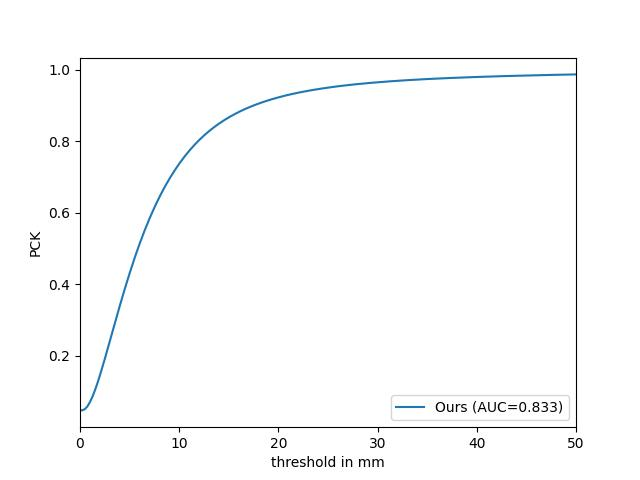

# Interacting Two-Hand 3D Pose and Shape Reconstruction from Single Color Image

### Interacting Two-Hand 3D Pose and Shape Reconstruction from Single Color Image
Baowen Zhang, Yangang Wang, Xiaoming Deng*, Yinda Zhang*, Ping Tan, Cuixia Ma and Hongan Wang

[Project page](https://baowenz.github.io/Intershape/)   &nbsp;  &nbsp;  &nbsp;  [Paper](https://openaccess.thecvf.com/content/ICCV2021/papers/Zhang_Interacting_Two-Hand_3D_Pose_and_Shape_Reconstruction_From_Single_Color_ICCV_2021_paper.pdf)   &nbsp;  &nbsp;  &nbsp;  [Supp](https://openaccess.thecvf.com/content/ICCV2021/supplemental/Zhang_Interacting_Two-Hand_3D_ICCV_2021_supplemental.pdf)


This repository contains the model of the ICCV'2021 paper ["Interacting Two-Hand 3D Pose and Shape Reconstruction from Single Color Image"](https://openaccess.thecvf.com/content/ICCV2021/papers/Zhang_Interacting_Two-Hand_3D_Pose_and_Shape_Reconstruction_From_Single_Color_ICCV_2021_paper.pdf).

We propose a novel deep learning framework to reconstruct 3D hand poses and shapes of two interacting hands from a single color image. Previous methods designed for single hand cannot be easily applied for the two hand scenario because of the heavy inter-hand occlusion and larger solution space. In order to address the occlusion and similar appearance between hands that may confuse the network, we design a hand pose-aware attention module to extract features associated to each individual hand respectively. We then leverage the two hand context presented in interaction and propose a context-aware cascaded refinement that improves the hand pose and shape accuracy of each hand conditioned on the context between interacting hands. Extensive experiments on the main benchmark datasets demonstrate that our method predicts accurate 3D hand pose and shape from single color image, and achieves the state-of-the-art performance.

## Update (2022-8-19)
**Training and testing codes are released!**

The history version is at [Two-Hand-Shape-Pose](https://github.com/BaowenZ/Two-Hand-Shape-Pose), which was trained on InterHand2.6M(v0).
In this version, we provide the model trained on InterHand2.6M(v1.0). 

**The performance of our method is updated as follows. If you evaluate your method on InterHand2.6M(v1.0), please cite the update results in your paper. Thanks!**


# 1. Installation
Create environment
```
conda create -n double_hand python=3.9
conda activate double_hand 
```
Install pytorch
```
pip install torch==1.12.1+cu116 torchvision==0.13.1+cu116 torchaudio==0.12.1 --extra-index-url https://download.pytorch.org/whl/cu116
```
Install other packages
```
pip install -r requirements.txt
```
# 2. Demo
## Download models
Download pre-trained model [snapshot_99.pth.tar](https://drive.google.com/drive/folders/1RAQ_Bxh4LIdJS8uxEVNMrR3nzqTbelZo) and put it into folder `demo/`.
The model is trained on InterHand2.6M(v1.0) including images of 5fps.

Download the MANO model files from [MANO](https://mano.is.tue.mpg.de/). Place `MANO_LEFT.pkl` and `MANO_RIGHT.pkl` at `mano/`.

Go to `demo/` and run the code
```
python demo.py --test_epoch 99
```
The model will predict hand shapes from images in `test_folder/`. The estimated meshes are saved as obj files in `test_data/`.

# 3. Training
Download [InterHand2.6M](https://mks0601.github.io/InterHand2.6M/) dataset.

Set the self.dataset_path variable as the path of InterHand2.6M.

Pre-trained [InterNet](https://github.com/facebookresearch/InterHand2.6M) model need to be prepared for training. We provide the [InterNet model](https://drive.google.com/drive/folders/18SSbDWDYhSd9T9Xf-PbBkBQ8mmm-DPQy) trained on images of interacting hands in InterHand2.6M. Place it at `InterNet_model/`.

Go to `main/` and run the training code
```
python train.py --gpu 0-3
```

The code makes folder `output/model_dump/` and the parameters of tained model will be placed in the folder. 

# 4. Testing
Go to `main/` and run the training code
```
python test.py --gpu 0-3 --test_epoch 99 --test_set test
```

Model in `output/model_dump/` is used for testing. If you only want to evaluate our model without training, you can create the folder and place the [pre-trained model](https://drive.google.com/drive/folders/1RAQ_Bxh4LIdJS8uxEVNMrR3nzqTbelZo) at the folder in advance.

If you have properly done the previous steps, you will get the results that
```
MPJPE for all hand sequences: 8.64
MPVPE for all hand sequences: 9.59
```
And the auc is calcuated.



# 5. Citation
Please consider citing the paper if you use this code.
```
@inproceedings{Zhang2021twohand, 
      title={Interacting Two-Hand 3D Pose and Shape Reconstruction from Single Color Image}, 
      author={Baowen Zhang, Yangang Wang, Xiaoming Deng, Yinda Zhang, Ping Tan, Cuixia Ma and Hongan Wang}, 
      booktitle={International Conference on Computer Vision (ICCV)}, 
      year={2021} 
} 
```

# 6. Acknowledgement

We build this project based on [InterHand](https://github.com/facebookresearch/InterHand2.6M).

We use part of the great code from [InterNet](https://mks0601.github.io/InterHand2.6M/), [mano prediction block](https://github.com/hassony2/manopth) and [mano layer](https://github.com/vchoutas/smplx).

Image samples in `demo/test_data/` are from [InterHand2.6M](https://mks0601.github.io/InterHand2.6M/). 

We thank the authors of InterHand, InterNet, InterHand2.6M, mano prediction block and mano layer for their great works.

# 7. Contact Information
For any questions, feel free to contact: 947976219@qq.com, xiaoming@iscas.ac.cn


